# Communication Systems simulation Projects
## Simulations from the project Channel Effects, Equalizers, MIMO Systems, and Practical Systems
<table>
  <tr>
    <td>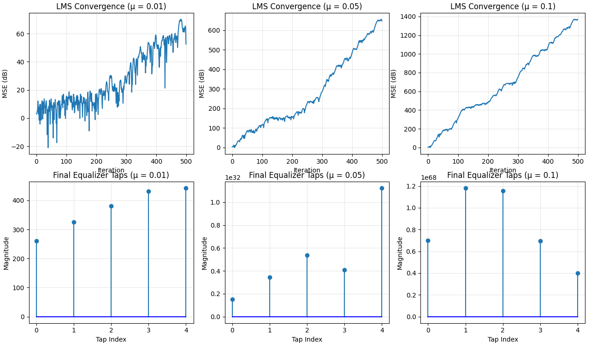</td>
    <td>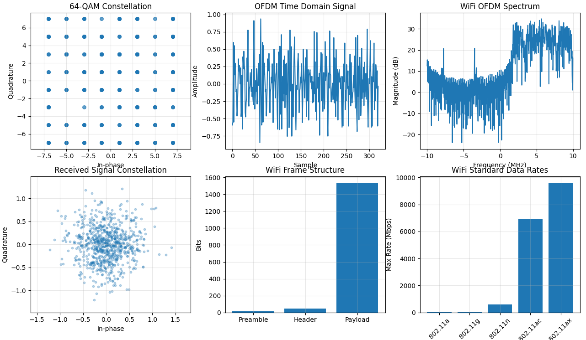</td>
    <td>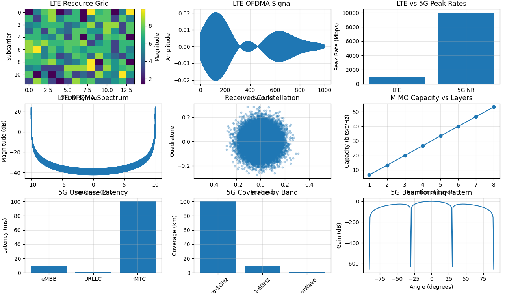</td>
  </tr>
</table>

<table>
  <tr>
    <td>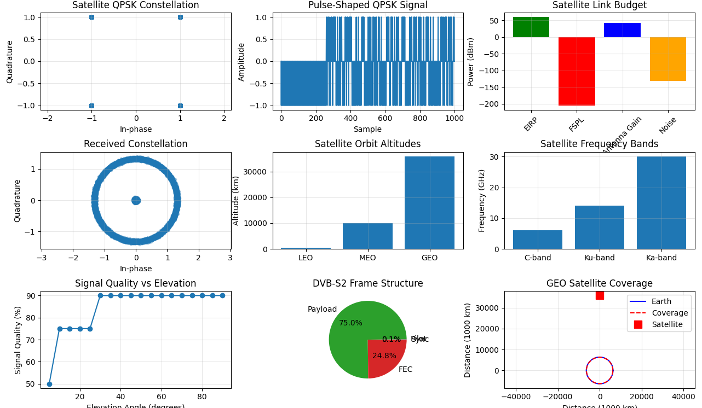</td>
    <td>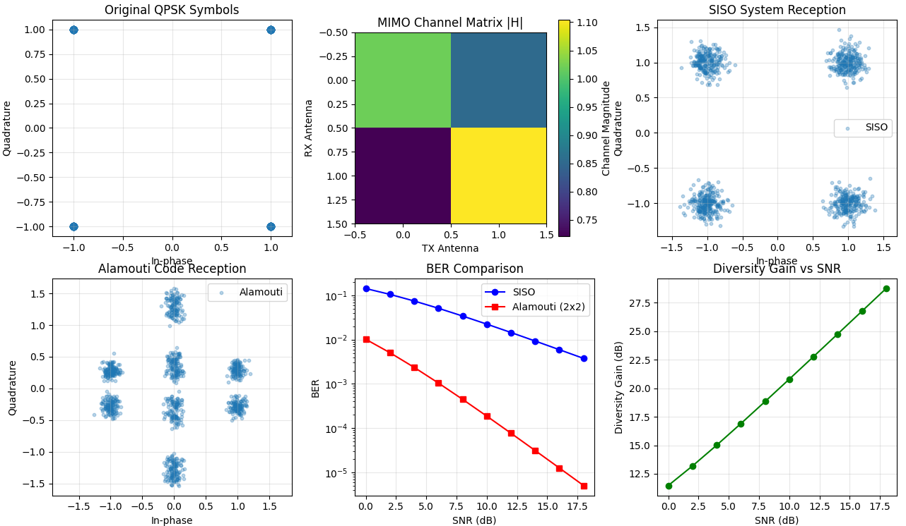</td>
    <td>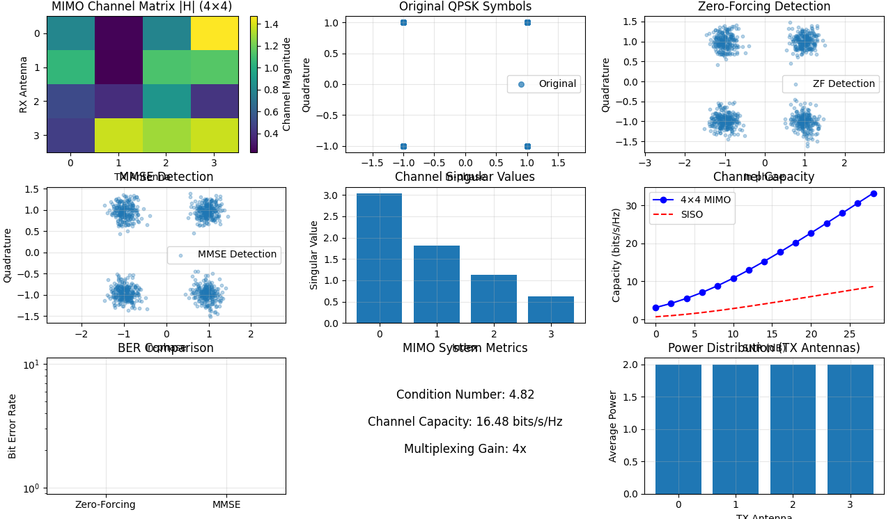</td>
  </tr>
</table>

<table>
  <tr>
    <td>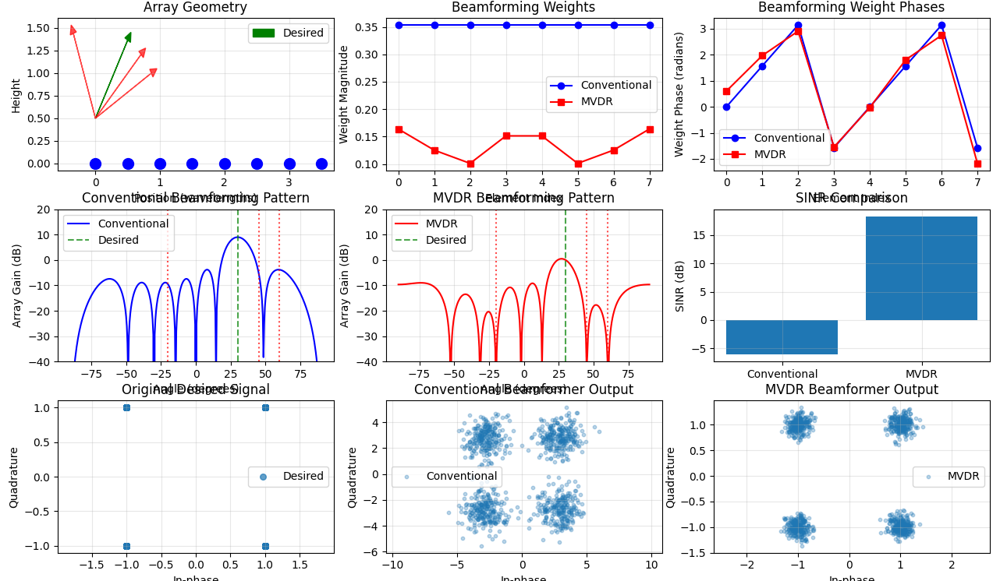</td>
    <td>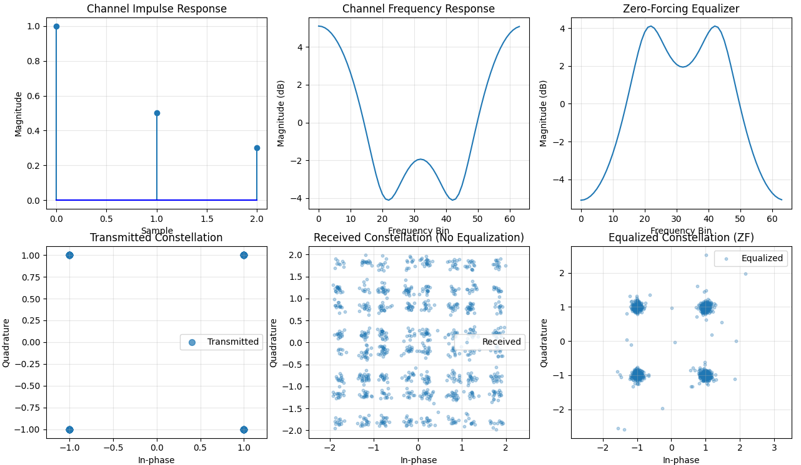</td>
    <td>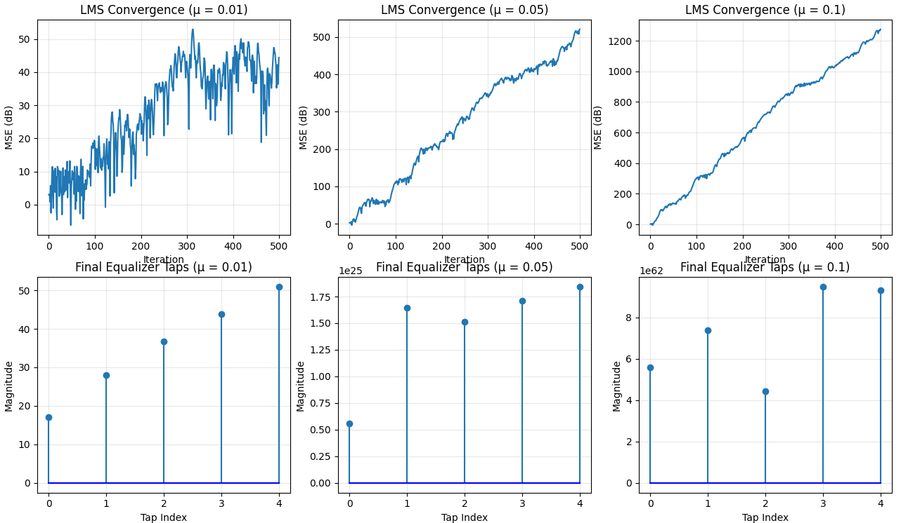</td>
  </tr>
</table>

<table>
  <tr>
    <td>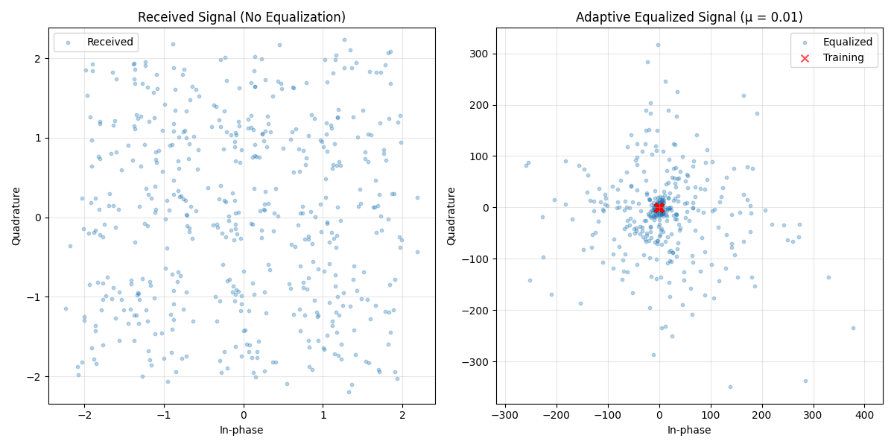</td>
    <td>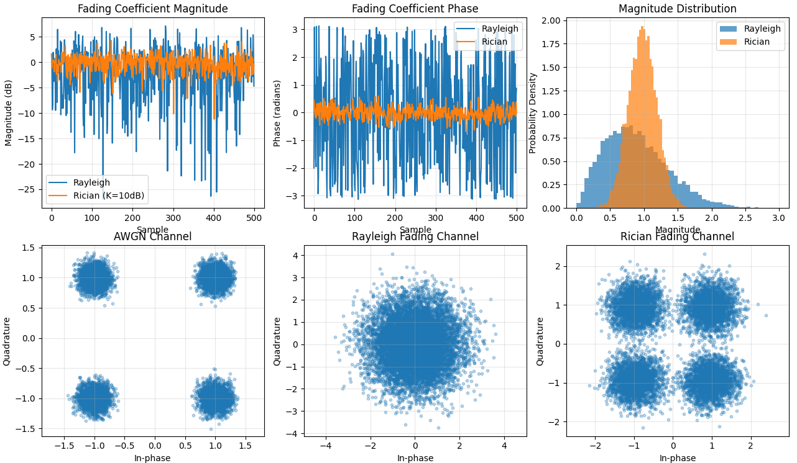</td>
    <td>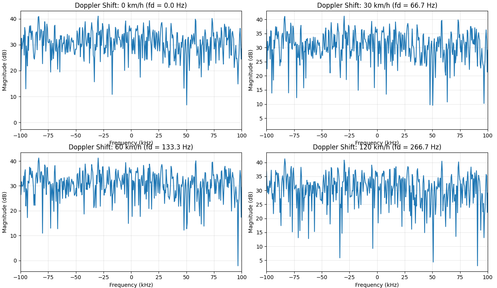</td>
  </tr>
</table>

---

## 📋 Table of Contents
1. [Overview](#overview)
2. [Project 3: Channel Effects](#project-3-channel-effects)
3. [Project 4: Equalizers](#project-4-equalizers)
4. [Project 6: MIMO Systems](#project-6-mimo-systems)
5. [Project 7: Practical Systems](#project-7-practical-systems)
6. [Getting Started](#getting-started)
7. [Dependencies](#dependencies)
8. [Educational Resources](#educational-resources)

---

## 🎯 Overview

This document provides a comprehensive guide to four advanced communication systems projects that form the backbone of modern wireless communication theory and practice. These projects cover the fundamental challenges of wireless communication and the sophisticated solutions developed to overcome them.

### Why These Projects Matter

Modern wireless communication systems face numerous challenges:
- **Multipath propagation** causes signal distortion and fading
- **Doppler effects** from mobile devices create frequency shifts
- **Interference** from multiple sources degrades signal quality
- **Limited spectrum** requires efficient use of available bandwidth
- **Multiple users** need to share the same resources

Projects 3, 4, 6, and 7 directly address these challenges through:
- Advanced channel modeling and effects simulation
- Sophisticated equalization techniques
- Multiple-antenna systems (MIMO)
- Real-world system implementations

---

## 📡 Project 3: Channel Effects

### 🔬 Theory Background

Wireless channels are fundamentally different from wired channels due to the propagation environment. Understanding channel effects is crucial for designing robust communication systems.

#### Key Concepts

**1. Multipath Propagation**
- Radio waves travel multiple paths from transmitter to receiver
- Paths have different delays, amplitudes, and phases
- Results in constructive and destructive interference
- Causes **fading** - rapid fluctuations in signal strength

**2. Fading Types**
- **Rayleigh Fading**: No direct line-of-sight (LOS) path
  - Magnitude follows Rayleigh distribution
  - Common in urban environments with obstacles
- **Rician Fading**: Strong LOS path + scattered components
  - Magnitude follows Rician distribution
  - Common in rural/suburban areas

**3. Doppler Effects**
- Movement causes frequency shifts: `f_d = (v/c) * f_c * cos(θ)`
- Creates **Doppler spread** - signal bandwidth expansion
- Affects **coherence time** - how long channel remains constant

**4. Frequency Selective Fading**
- Different frequencies experience different fading
- Caused by **delay spread** from multipath
- Creates **inter-symbol interference (ISI)**

### 🛠️ Project Implementation

**File:** `03_channel_effects.py`

#### Features
1. **Multipath Fading Simulation**
   - Generates Rayleigh and Rician fading coefficients
   - Jakes' model for realistic fading statistics
   - Constellation diagrams showing fading impact

2. **Doppler Effects Analysis**
   - Frequency shift calculations for different velocities
   - Doppler spread impact on OFDM systems
   - Coherence time vs. symbol duration analysis

3. **Frequency Selective Fading**
   - Multiple channel profiles (LOS, Urban, Suburban)
   - RMS delay spread calculations
   - Coherence bandwidth analysis

#### Key Algorithms
- **Jakes' Model**: Realistic fading generation
- **Doppler Shift**: Frequency offset simulation
- **Multipath Channel**: Impulse response modeling

### 🌍 Applications

**Cellular Systems (4G/5G)**
- Channel modeling for system design
- Handover algorithms based on fading statistics
- Adaptive modulation and coding

**Satellite Communications**
- Rain fade modeling and mitigation
- Doppler compensation for LEO satellites
- Link budget analysis

**WiFi Systems**
- Indoor multipath modeling
- Antenna diversity techniques
- Channel estimation algorithms

**Radar Systems**
- Target detection in multipath environments
- Clutter modeling and suppression
- Moving target indication

---

## ⚖️ Project 4: Equalizers

### 🔬 Theory Background

Equalizers are essential components that compensate for channel distortion, recovering the original transmitted signal from the received distorted version.

#### Key Concepts

**1. Inter-Symbol Interference (ISI)**
- Multipath causes symbols to overlap in time
- Current symbol interferes with previous/next symbols
- Severely degrades bit error rate (BER)

**2. Equalizer Types**
- **Linear Equalizers**: Process received signal linearly
  - Zero-Forcing (ZF): Completely removes ISI
  - Minimum Mean Square Error (MMSE): Balances ISI and noise
- **Non-linear Equalizers**: More complex but better performance
  - Decision Feedback Equalizer (DFE)
  - Maximum Likelihood Sequence Estimation (MLSE)

**3. Adaptive Equalizers**
- Continuously adapt to changing channel conditions
- Common algorithms: LMS, RLS, CMA
- Essential for mobile communications

**4. Frequency Domain Equalization**
- Efficient for wideband systems (OFDM)
- Single-tap equalizers per subcarrier
- Reduces computational complexity

### 🛠️ Project Implementation

**File:** `04_equalizers.py`

#### Features
1. **Zero-Forcing Equalizer**
   - Complete ISI removal: `W_ZF = H^(-1)`
   - Noise enhancement at channel nulls
   - Frequency domain implementation

2. **MMSE Equalizer**
   - Optimal trade-off between ISI and noise
   - `W_MMSE = H* / (|H|^2 + σ^2)`
   - Superior performance at low SNR

3. **Adaptive LMS Equalizer**
   - Least Mean Squares algorithm
   - Real-time adaptation to channel changes
   - Convergence analysis and visualization

#### Key Algorithms
- **Matrix Inversion**: ZF equalizer computation
- **Wiener Filter**: MMSE equalizer derivation
- **LMS Algorithm**: Adaptive filter updates
- **Viterbi Algorithm**: MLSE implementation

### 🌍 Applications

**Digital Broadcasting**
- Terrestrial TV (DVB-T/T2)
- Digital audio broadcasting (DAB)
- Multipath mitigation in urban areas

**Wireline Communications**
- DSL modems: copper line equalization
- Cable modems: coaxial cable distortion
- Fiber optic systems: dispersion compensation

**Underwater Communications**
- Acoustic channel equalization
- Doppler and multipath compensation
- ROV and AUV communications

**Storage Systems**
- Hard disk drives: read channel equalization
- Optical storage: CD/DVD/Blu-ray
- Magnetic tape storage systems

---

## 📶 Project 6: MIMO Systems

### 🔬 Theory Background

Multiple-Input Multiple-Output (MIMO) systems use multiple antennas at both transmitter and receiver to dramatically improve performance and capacity.

#### Key Concepts

**1. Spatial Diversity**
- Multiple antennas provide independent fading paths
- Reduces probability of deep fades
- Improves reliability and coverage

**2. Spatial Multiplexing**
- Transmit multiple data streams simultaneously
- Achieves **multiplexing gain**: capacity increases linearly with min(Nt, Nr)
- Fundamental to high-speed wireless systems

**3. Beamforming**
- Directional transmission/reception
- Focuses energy toward intended receiver
- Reduces interference to/from other users

**4. Space-Time Coding**
- Combines spatial and temporal diversity
- Alamouti code: simple 2x1 scheme
- Achieves diversity without channel knowledge

**5. Channel Capacity**
- MIMO channel capacity: `C = log2(det(I + (ρ/Nt)HH*))`
- Dramatic capacity gains over SISO systems
- Depends on channel rank and correlation

### 🛠️ Project Implementation

**File:** `06_mimo_systems.py`

#### Features
1. **Spatial Multiplexing**
   - V-BLAST architecture
   - Successive interference cancellation
   - Capacity analysis and visualization

2. **Beamforming Algorithms**
   - Maximum Ratio Transmission (MRT)
   - Zero-Forcing Beamforming
   - MMSE beamforming

3. **Space-Time Coding**
   - Alamouti code implementation
   - Diversity analysis
   - Performance comparison

4. **Channel Modeling**
   - Rayleigh MIMO channels
   - Correlation effects
   - Condition number analysis

#### Key Algorithms
- **SVD Decomposition**: Optimal MIMO processing
- **Water-filling**: Power allocation
- **Alamouti Decoding**: Space-time processing
- **Beamforming**: Spatial filtering

### 🌍 Applications

**5G/6G Networks**
- Massive MIMO: 64-256 antennas
- Beamforming for mmWave communications
- Multi-user MIMO (MU-MIMO)

**WiFi Systems**
- 802.11n/ac/ax: up to 8x8 MIMO
- Multi-user downlink (MU-MIMO)
- Beamforming for range extension

**Satellite Communications**
- Multiple beam satellites
- Interference mitigation
- Capacity enhancement

**Radar Systems**
- MIMO radar: improved resolution
- Beamforming for target tracking
- Electronic warfare applications

---

## 🌐 Project 7: Practical Systems

### 🔬 Theory Background

This project implements real-world communication systems, demonstrating how theoretical concepts translate into practical deployments.

#### Key Concepts

**1. WiFi (802.11)**
- OFDM modulation with 64 subcarriers
- Adaptive modulation and coding
- CSMA/CA medium access control
- Multiple antenna techniques

**2. LTE/5G Cellular**
- OFDMA downlink, SC-FDMA uplink
- Frame structure and resource allocation
- MIMO and beamforming integration
- Quality of Service (QoS) management

**3. Satellite Communications**
- Geostationary (GEO) vs. Low Earth Orbit (LEO)
- Link budget analysis
- Doppler compensation
- Rain fade mitigation

**4. System Design Considerations**
- Spectrum efficiency
- Power efficiency
- Complexity vs. performance trade-offs
- Standardization and interoperability

### 🛠️ Project Implementation

**File:** `07_practical_systems.py`

#### Features
1. **WiFi System Simulation**
   - Complete OFDM transceiver
   - QAM modulation (16/64-QAM)
   - Pilot insertion and channel estimation
   - Packet error rate analysis

2. **LTE Physical Layer**
   - Resource block structure
   - OFDMA/SC-FDMA implementation
   - MIMO spatial multiplexing
   - Scheduling algorithms

3. **Satellite Link Analysis**
   - Link budget calculations
   - Atmospheric effects modeling
   - Doppler shift compensation
   - Rain fade statistics

#### Key Algorithms
- **OFDM Transceiver**: Complete implementation
- **Channel Estimation**: Pilot-based methods
- **Resource Allocation**: Scheduler design
- **Link Budget**: System design tool

### 🌍 Applications

**Commercial WiFi**
- Home and office networks
- Public hotspots
- Mesh networking
- IoT connectivity

**Cellular Networks**
- Mobile broadband
- Voice over LTE (VoLTE)
- Massive IoT
- Ultra-reliable low-latency communications (URLLC)

**Satellite Systems**
- Direct-to-home TV
- Satellite internet (Starlink, OneWeb)
- GPS and navigation
- Earth observation

**Industrial Systems**
- Process automation
- Smart grid communications
- Autonomous vehicles
- Industry 4.0 applications

---

## 🚀 Getting Started

### Prerequisites
- Python 3.8+
- Basic understanding of digital signal processing
- Linear algebra fundamentals
- Complex number arithmetic

### Installation
```bash
# Clone or download the project
cd communicationsproject

# Install dependencies
pip install -r requirements.txt

# Run individual projects
python 03_channel_effects.py
python 04_equalizers.py
python 06_mimo_systems.py
python 07_practical_systems.py

# Or use the interactive launcher
python main.py
```

### Quick Start Guide
1. **Start with Project 3** to understand channel effects
2. **Progress to Project 4** to learn equalization techniques
3. **Explore Project 6** for MIMO system concepts
4. **Conclude with Project 7** for practical implementations

---

## 📦 Dependencies

### Core Libraries
- `numpy`: Numerical computing
- `scipy`: Scientific computing
- `matplotlib`: Data visualization
- `warnings`: Error handling

### Optional Libraries
- `jupyter`: Interactive notebooks
- `seaborn`: Enhanced plotting
- `pandas`: Data analysis

---

## 📚 Educational Resources

### Recommended Textbooks
1. **"Wireless Communications" by Andrea Goldsmith**
   - Comprehensive coverage of wireless fundamentals
   - Excellent for channel modeling and MIMO

2. **"Digital Communications" by John Proakis**
   - Classic text on digital communication theory
   - Strong emphasis on equalization techniques

3. **"MIMO-OFDM Wireless Communications" by Yong Soo Cho**
   - Specialized coverage of MIMO and OFDM
   - Practical implementation details

### Online Resources
- **MIT OpenCourseWare**: 6.450 Principles of Digital Communications
- **Stanford Online**: EE379A Digital Communication Systems
- **Coursera**: Wireless Communications Specialization

### Standards Documents
- **IEEE 802.11**: WiFi standards
- **3GPP**: LTE and 5G specifications
- **ITU-R**: Satellite communication recommendations

### Research Papers
- Claude Shannon: "A Mathematical Theory of Communication"
- Gerard Foschini: "Layered Space-Time Architecture"
- Siavash Alamouti: "A Simple Transmit Diversity Technique"

---

## 🎓 Learning Objectives

By completing these projects, students will:

1. **Understand Channel Effects**
   - Model realistic wireless channels
   - Analyze fading and Doppler effects
   - Design systems robust to channel impairments

2. **Master Equalization Techniques**
   - Implement linear and adaptive equalizers
   - Understand ISI mitigation strategies
   - Analyze performance trade-offs

3. **Explore MIMO Systems**
   - Understand spatial diversity and multiplexing
   - Implement beamforming algorithms
   - Analyze capacity and performance gains

4. **Apply Practical System Design**
   - Implement real-world communication systems
   - Understand system-level considerations
   - Bridge theory and practice

---

## 🔧 Troubleshooting

### Common Issues
1. **Import Errors**: Ensure all dependencies are installed
2. **Plotting Issues**: Check matplotlib backend configuration
3. **Performance**: Reduce simulation parameters for faster execution
4. **Memory**: Large matrix operations may require more RAM

### Getting Help
- Check the inline documentation in each project file
- Review the console output for error messages
- Experiment with different parameters
- Consult the educational resources listed above

---

## 📄 License

This project is for educational purposes. Please respect the intellectual property rights of the referenced materials and standards.

---

## 👥 Contributing

This is an educational project. Contributions that improve clarity, add educational value, or fix bugs are welcome.

---

**Happy Learning! 🚀**

*Master the fundamentals of modern wireless communication through hands-on experimentation and analysis.*
